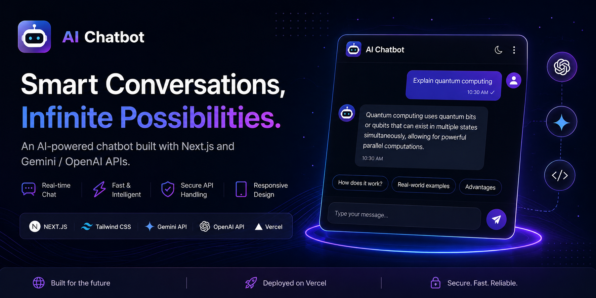

<div align="center">

# 🤖 AI Chatbot

### A modern ChatGPT-like AI assistant built with Next.js + Gemini/OpenAI APIs

<br/>

<!-- HERO BANNER -->


<br/><br/>

<!-- BADGES -->
[](https://ai-chatbot-iota-gilt.vercel.app/)
[](https://nextjs.org/)
[](https://vercel.com/)
[](https://ai.google.dev/)
[](https://openai.com/)
[](https://tailwindcss.com/)

</div>

---


## 🌟 Overview

This AI Chatbot is a **smart conversational assistant** that generates human-like responses using powerful LLM APIs like **Google Gemini** or **OpenAI**.

It provides a smooth ChatGPT-style experience with a modern UI and fast response streaming.

---

## ✨ Features

- 💬 Real-time AI chat interface  
- 🧠 Powered by Gemini / OpenAI  
- ⚡ Streaming fast responses  
- 🎨 Modern ChatGPT-style UI  
- 📱 Fully responsive design  
- 🌙 Dark mode support  
- 🔐 Secure API handling via environment variables  
- ☁️ One-click deployment on Vercel  

---

## 🛠️ Tech Stack

- **Framework:** Next.js (App Router)  
- **Language:** TypeScript  
- **Styling:** Tailwind CSS  
- **AI APIs:** Gemini / OpenAI  
- **Backend:** Next.js API Routes  
- **Deployment:** Vercel  

---

## 📁 Project Structure

```bash id="7f8k1d"
/app
  /api            # AI chat backend routes
  /components     # UI components
  /lib            # Utility functions
/public           # Static assets

## 📦 Installation

Clone the repository:

```bash
git clone https://github.com/SharathMengani/ai-chatbot.git
cd ai-chatbot